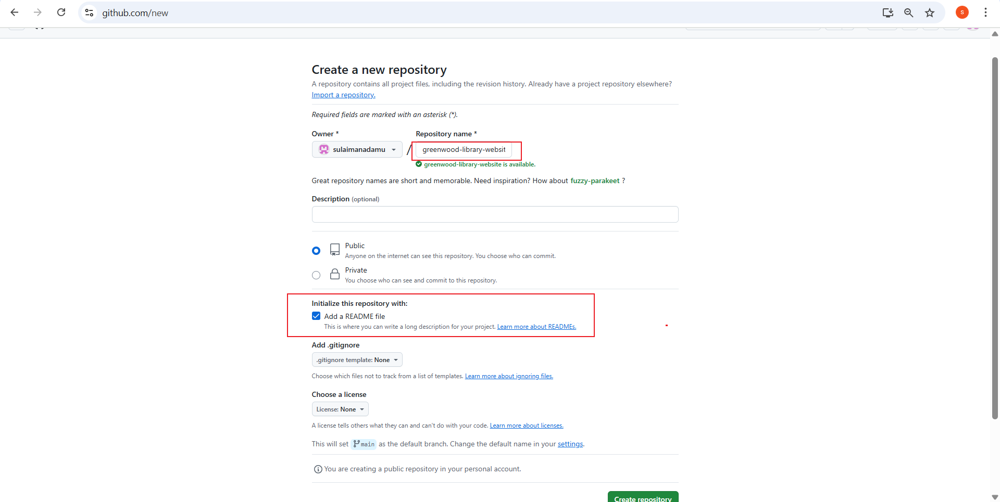

# greenwood-library-website
create a github repo and initialized it with a readme file

clone the greenwood-library-website

created all the files for the main project on the main branch.

on the main branch the project structure is pushed 

Morgan created a branch and switch to the branch.

morgan create book-reviews.html file added random text and push it.

morgan raise pull request

morgan pull request is merged to main

====================================================

jaime created a branch and switch to the branch and pull changes from main

jaime create update the events.html file and push changes to github.

jaime raise pull request

jaime pull request is merged to main

